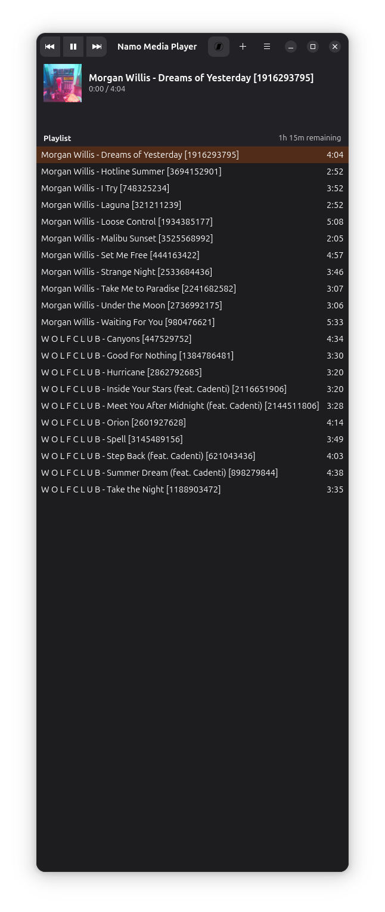

# Namo Media Player

Namo is a simple GTK4/Adwaita based media player written in Python, focusing on local music playback and basic library management.



## Features

*   Playback of local audio files supported by GStreamer.
*   Metadata display (Artist, Album, Title, Track Number).
*   Album artwork display.
*   Playlist management (adding, removing, saving, loading).
*   Import playlists/albums directly from Bandcamp URLs.
*   Standard media player controls (Play/Pause, Next/Previous, Seek, Volume).
*   Modern user interface using GTK4 and Libadwaita.

## Dependencies

**Core Requirements:**

*   Python 3
*   GTK4 & Libadwaita
*   GStreamer (with appropriate plugins)
*   PyGObject (Python bindings for GObject libraries like GTK, GStreamer, etc.)

**Python Libraries:**

*   `mutagen` (for audio metadata)
*   `requests` (for network requests, e.g., Bandcamp import)
*   `beautifulsoup4` (for parsing HTML, e.g., Bandcamp import)

## Installation

Install the necessary dependencies for your Linux distribution:

### Fedora

```bash
sudo dnf install python3 python3-gobject gtk4 libadwaita python3-mutagen python3-requests python3-beautifulsoup4 gstreamer1-plugins-base gstreamer1-plugins-good gstreamer1-plugins-bad-free gstreamer1-plugins-ugly-free gstreamer1-libav
```

### Debian / Ubuntu

```bash
sudo apt update
sudo apt install python3 python3-gi python3-gi-cairo gir1.2-gtk-4.0 gir1.2-adw-1 python3-mutagen python3-requests python3-bs4 gir1.2-gst-plugins-base-1.0 gir1.2-gstreamer-1.0 python3-gst-1.0 gstreamer1.0-plugins-base gstreamer1.0-plugins-good gstreamer1.0-plugins-bad gstreamer1.0-plugins-ugly gstreamer1.0-libav
```

**Note on GStreamer Plugins:** The specific GStreamer plugins listed provide support for a wide range of common audio formats. You might need additional `gstreamer1.0-plugins-*` or `gstreamer1-plugins-*` packages depending on the specific audio codecs you intend to play. `gstreamer1.0-libav` (Debian/Ubuntu) or `gstreamer1-libav` (Fedora) is often required for formats like MP3 and AAC.

## Running Namo

Navigate to the project's root directory in your terminal and run:

```bash
python3 namo.py
